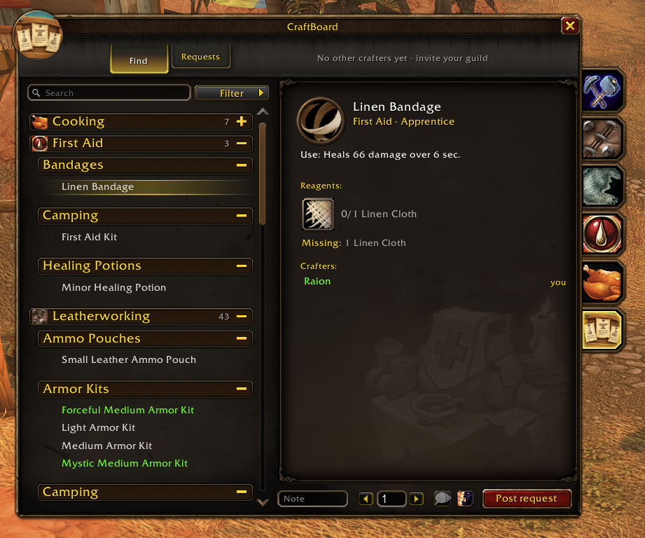

# CraftBoard

Crafting orders for World of Warcraft: Forever.

Forever brought back the Classic world but not retail's crafting orders, so finding a crafter still
means repeating "LF LW, have mats" in Trade and hoping. CraftBoard adds a crafting board to the
game's own Professions window: see who can craft what, whisper them, or post a request that
crafters on your realm can see.

**Download:** [CurseForge](https://www.curseforge.com/wow/addons/craftboard) or the
[GitHub releases](https://github.com/MartinPTielemans/craftboard/releases). Works with the
CurseForge app and WowUp under the Forever game version.

## Features

- **Part of the Professions window.** CraftBoard is a tab under your profession tabs, built from
  the same frame, fonts and textures as Blizzard's window. Characters without professions get the
  same board as a standalone window.
- **Recipes shared automatically.** Open each profession window once and every recipe you know is
  shared with other CraftBoard users on your realm. Bind-on-Pickup crafts are never shared, since
  nobody can hand those over.
- **Find.** Search any item and see everyone who can craft it, grouped by category like
  Blizzard's list. Reagents show what you have and what is missing.
- **Requests.** Post an order with a quantity and a note. Crafters see it on the board and offer
  with one click.
- **Seen in chat.** Players asking for a crafter in Trade or General ("LF enchanter", "WTB [item]")
  are listed on the Requests tab, with a green check when you can make it. This works even when
  nobody else on your realm runs CraftBoard.
- **Busy mode.** Mark yourself busy and other users see you greyed out and can't whisper you from
  the board. It turns on by itself in dungeons, raids and combat.
- **Advertise.** One button posts a single plain line to Trade for players without the addon, at
  most once a minute.
- **Easy to reach.** Minimap button, addon compartment, a key binding, and `/cb`.

## Principles

- **Nothing happens on its own.** CraftBoard never sends a whisper, invite, trade or chat line
  without your click. No keyword auto-replies.
- **No gold.** Prices and tips are agreed in whispers, like always. Nothing here works like an
  auction house or GDKP.
- **Fair ordering.** Online crafters are listed first, then shuffled each session. There are no
  ratings, featured spots or anything you can pay for.
- **Private by default.** Chat lines are kept in memory for 30 minutes and never saved or shared.
- **Non-combat.** Unaffected by Forever's combat addon restrictions.

## Commands

| Command | What it does |
|---|---|
| `/cb` | Open or close the board |
| `/cb busy` | Toggle busy |
| `/cb scan` | Rescan the open profession window |
| `/cb options` | Open the settings |
| `/cb welcome` | Show the welcome window again |
| `/cb debug` | Show sync status and known crafters |
| `/cb chatdebug` | Show what the chat watcher is picking up |

The minimap button opens the board on left-click and the settings on right-click.
Shift-right-click toggles busy. Settings live under Options > AddOns > CraftBoard.

## Status

Beta. Everything is tested in-game on Forever, but the board only gets useful as more players on
a realm install it. Bug reports and ideas are welcome in
[issues](https://github.com/MartinPTielemans/craftboard/issues). A BugSack report and the output
of `/cb debug` help the most.

## Development

- `CraftBoard/` is the addon. Modules: Core, Locales, Options, Launcher, Recipes, Inventory, Comm,
  ChatWatch, UI, Onboarding, Welcome, Hooks, Embed, Debug. The design is in `docs/SPEC.md`.
- `tools/link.sh` symlinks the addon into the Forever AddOns folder for live testing.
- `tools/check.sh` parses every Lua file and checks that all locale keys are used and defined.
- `tools/package.sh` builds a release zip locally. Tagged releases are built and uploaded by the
  GitHub workflow; see `docs/RELEASING.md`.
- `docs/IDEAS.md` collects requested features and the decisions made on them.

Built with AI assistance (Claude and Codex), designed and tested in-game by the author.

MIT licensed.
